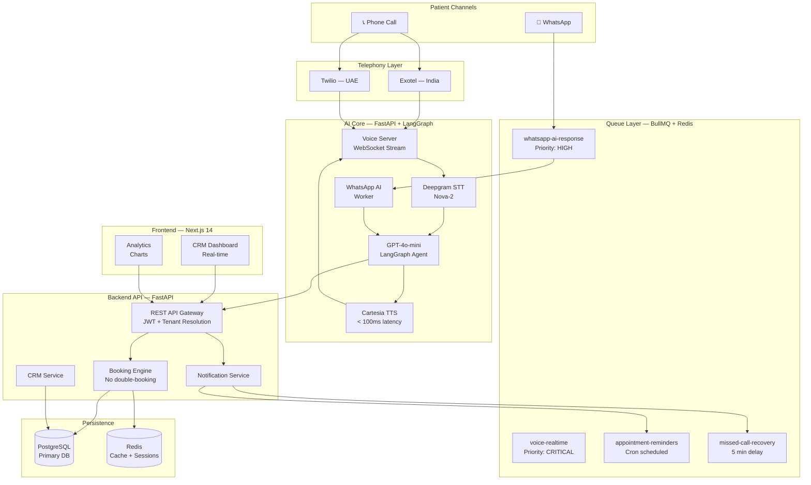
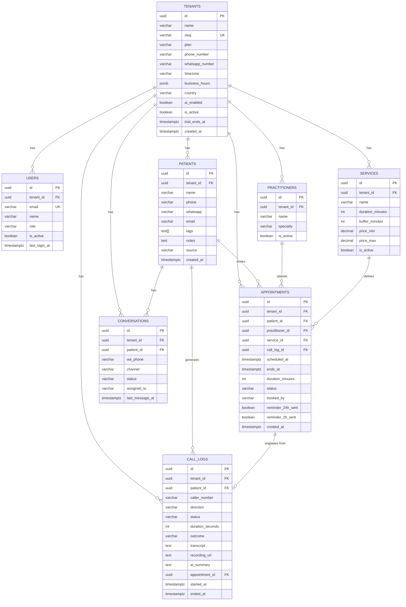
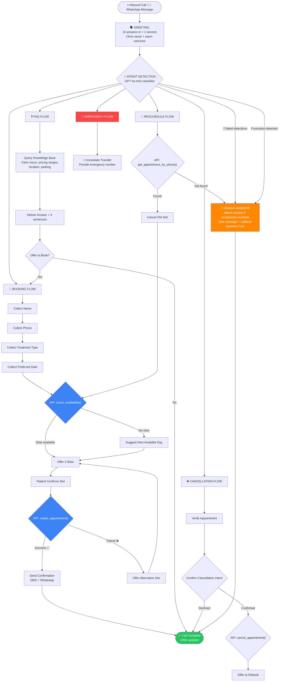

## Overview

**ClinicFlow AI** is a vertical AI SaaS platform purpose-built for dental clinics in India and UAE. It automates the entire front-desk communication loop — answering calls, booking appointments, sending reminders, recovering missed calls, and managing patient communication — through an AI voice receptionist and WhatsApp automation layer, backed by a real-time CRM dashboard.

> *"I can't be answering calls in the middle of a root canal."* — Dr. Rajesh Sharma, Bengaluru

This is not a generic chatbot builder. It is a set-and-forget AI front desk that plugs into a clinic's existing phone number and WhatsApp, works 24/7, and makes every clinic look like it has a 5-star receptionist on duty at all times.

---

## The Problem

Dental clinics lose significant revenue daily from a solvable operational problem: **their phones go unanswered.**

| Problem | Frequency | Revenue Impact |
|---|---|---|
| Unanswered calls (after hours) | 30–50% of all inbound calls | ₹3,000–₹15,000 lost per missed appointment |
| No-show appointments (no reminders) | 15–25% no-show rate | Direct revenue loss + slot wastage |
| Missed WhatsApp inquiries (evenings) | Daily | Conversion drops to near zero after 30 min |
| Scheduling errors (double bookings) | Weekly | Patient trust damage, staff conflict |

### Why Existing Solutions Fail

- **Generic chatbots** (ManyChat, Tidio): Not trained on dental workflows. Cannot book appointments.
- **Basic IVR systems**: Cannot hold a conversation, collect information, or actually book.
- **Dental PMS software** (Practo, Cliniko): Operational software, not patient communication automation.
- **Human answering services**: Cost ₹15,000–₹40,000/month. Inconsistent quality. Cannot scale after hours.

---

## Market Opportunity

### India
- 120,000+ registered dental clinics
- ~80,000 clinics in the ICP (1–5 dentists)
- Willingness to pay: ₹5,000–₹15,000/month
- Addressable market: ₹4,800 Cr/year (~$580M)

### UAE
- 1,200+ licensed dental clinics
- Willingness to pay: AED 500–2,000/month
- Addressable market: ~$52M/year

**Target:** $10,000 MRR within 6 months. 50 paying clinics within 12 months.

---

## Architecture Overview

### System Architecture Diagram

---

## Entity Relationship Diagram

---

## AI Conversation State Machine & Data Flow

---

## Core Features

### AI Voice Receptionist

- Answers every inbound call to the clinic's phone number — 24/7
- Natural conversation: intent detection, patient info collection, real-time availability check, slot confirmation
- Response latency target: **< 800ms** end-to-end
- Conversation completion rate (no human needed): **> 70%**
- STT powered by **Deepgram Nova-2** with dental vocabulary keyword boosting
- TTS powered by **Cartesia** — < 100ms to first audio chunk
- Automatic fallback: any call AI cannot handle within 2 exchanges → warm transfer to receptionist

### WhatsApp AI Receptionist

- Inbound messages answered in < 30 seconds at any hour
- Handles: booking requests, pricing questions, hours, location, voice notes (transcribed via Deepgram)
- Missed call follow-up: sends WhatsApp within 5 minutes of a missed call
- Human handoff: receptionist takes over with one click from dashboard, AI pauses

### Appointment Booking Engine

- Real-time availability — computed at request time, never stale
- Per-doctor schedules, service durations, buffer times
- Hard double-booking prevention enforced at DB level (`UNIQUE` constraint)
- Timezone support: IST (India) and GST (UAE), stored as UTC
- On booking: SMS + WhatsApp confirmation, dashboard notification, Google Calendar event

### CRM Dashboard

- Live active call view with real-time transcript streaming
- Missed calls recovery queue with WhatsApp follow-up status
- Full WhatsApp conversation threads with one-click human takeover
- Appointment calendar (day/week), patient profiles, call logs with audio playback

### Automated Reminders

| Notification | Channel | Timing |
|---|---|---|
| Booking confirmation | WhatsApp + SMS | Immediate |
| 24-hour reminder | WhatsApp | 24h before |
| 2-hour reminder | WhatsApp | 2h before |
| Missed call follow-up | WhatsApp | 5 min after miss |
| Cancellation confirmation | WhatsApp + SMS | Immediate |

---

## Technical Stack

### Frontend
- Next.js 14 (App Router), TypeScript
- Shadcn UI, Tailwind CSS
- React Query, Zustand, Recharts
- Socket.io client (real-time call display)

### Backend
- FastAPI (Python) — AI-native, async throughout
- LangGraph — stateful conversation graph
- BullMQ + Redis — job queues for async processing
- PostgreSQL — primary relational data store

### AI & Voice
- LLM: OpenAI GPT-4o-mini (< 200ms to first token)
- STT: Deepgram Nova-2 streaming
- TTS: Cartesia (< 100ms first chunk)
- Telephony: Exotel (India) / Twilio (UAE)

### Infrastructure
- Docker + Docker Compose
- AWS (EC2, RDS, ElastiCache)
- Multi-tenant architecture (row-level isolation by `tenant_id`)

---

## AI Safety Rules

1. **Never** gives medical advice of any kind
2. **Never** quotes final prices — only ranges from the clinic's knowledge base
3. **Never** confirms a booking without a successful API response from the booking engine
4. **Always** offers human escalation within 3 exchanges if patient seems unsatisfied
5. **Immediately** transfers any call containing emergency keywords: "severe pain", "swelling", "bleeding", "broken tooth"
6. **Never** argues with a patient — disagreement triggers immediate human handoff

---

## What I'm Building & Learning

Working on ClinicFlow AI is teaching me how to architect a production AI system where reliability, latency, and trust are non-negotiable:

- Multi-tenant SaaS architecture with strict data isolation
- Real-time bidirectional audio streaming over WebSockets
- LLM function-calling patterns for tool-using AI agents
- Stateful conversation management with LangGraph
- Queue-first architecture for async AI processing at scale
- Dental domain knowledge encoding for vertical AI

---

## Roadmap

**V1 (Current Build):**
- AI voice receptionist (English)
- WhatsApp AI (English)
- Appointment booking engine
- CRM Dashboard
- Automated reminder system
- India launch (Tier 1 cities)

**V2 (Month 3–6):**
- Multilingual support (Hindi, Arabic)
- Dental PMS integrations (Practo, Cliniko)
- ElevenLabs voice cloning for custom clinic voices
- UAE launch (Dubai)

**V3 (Month 6–12):**
- Post-visit follow-up & recall campaigns
- Advanced analytics with revenue attribution
- Per-endpoint rate limiting and adaptive retry policies

---

## Key Takeaway

ClinicFlow AI demonstrates how vertical AI — built with deep domain specificity, voice-grade latency engineering, and strict safety constraints — can deliver a product that genuinely replaces a human role in a mission-critical business workflow.
