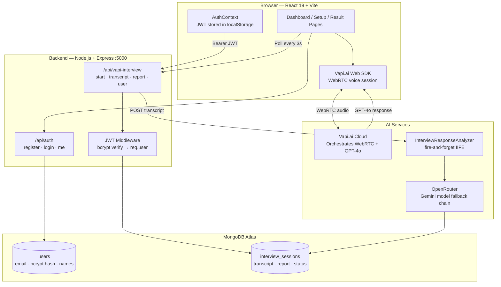
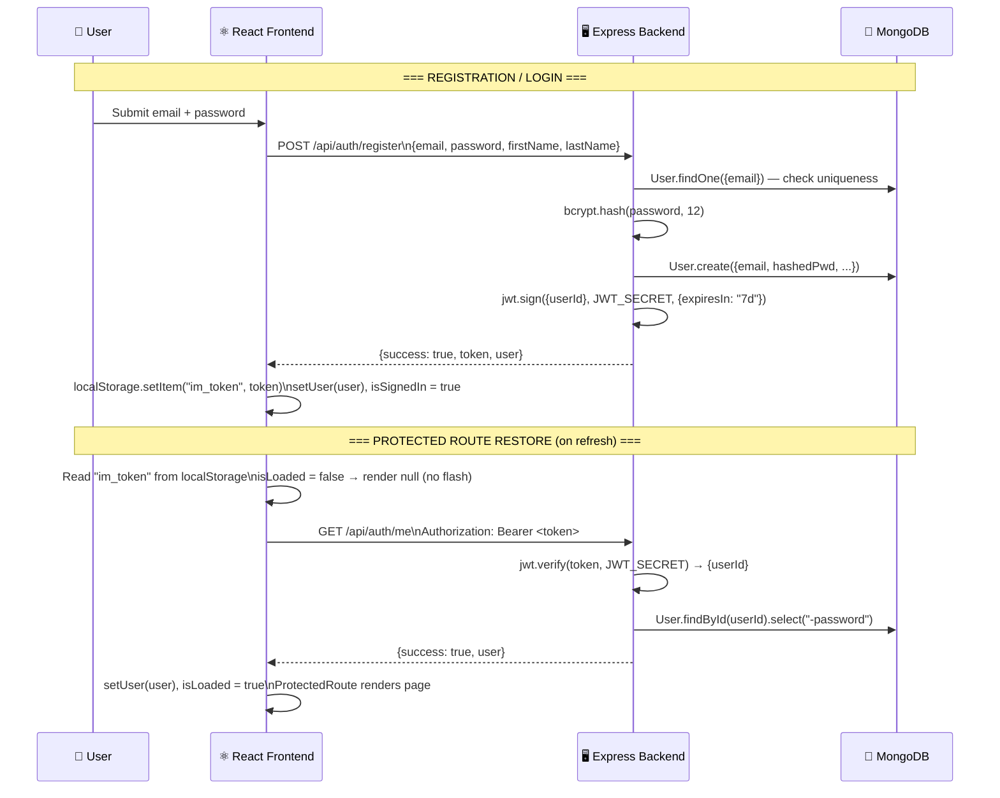

## Overview

**InterviewMate** is a full-stack AI mock interview platform built on the MERN stack. Users configure an interview session — selecting their target role, experience level, interview type, and AI interviewer agent — then conduct a live voice interview entirely in the browser. When the call ends, an AI analysis pipeline scores their performance across 8 dimensions and produces a detailed per-question feedback report.

The project is a **monorepo** with two independent apps: a Node.js/Express backend on port 5000, and a React 19 + Vite frontend on port 5173.

> Migrated from Clerk authentication to a custom JWT system post-launch to eliminate third-party auth dependency and reduce cost.

---

## Tech Stack

| Layer | Technology |
|---|---|
| Frontend | React 19, Vite, TailwindCSS |
| Backend | Node.js, Express.js |
| Database | MongoDB + Mongoose |
| Authentication | Custom JWT (bcrypt + jsonwebtoken) |
| AI Voice | Vapi.ai Web SDK → OpenAI GPT-4o |
| AI Analysis | OpenRouter → Google Gemini (3-model fallback) |
| Voice Synthesis | OpenAI TTS + ElevenLabs (11 agents) |

---

## System Architecture

---

## Authentication & Session Flow

---

## Interview Session & AI Analysis Pipeline

```mermaid
flowchart TD
    SETUP([🎙️ CreateInterview Page\nRole · Level · Type · Agent · Resume/JD]) --> START

    START["POST /api/vapi-interview/start\n+ JWT"]
    START --> SESSION_INIT["DB: InterviewSession created\nstatus: 'initialized'"]
    SESSION_INIT --> PROMPT["Build GPT-4o system prompt\nInject: role, level, agentName,\nresume/JD content, interview type rules"]
    PROMPT --> RESP["Return: {sessionId, systemPrompt, vapiPublicKey}"]

    RESP --> VAPI_CALL["Vapi.ai Web SDK\nvapi.start({\n  model: gpt-4o + systemPrompt,\n  voice: agent.provider + agent.voiceId,\n  firstMessageMode: assistant-speaks-first\n})"]

    VAPI_CALL --> WEBRTC["🎧 Live WebRTC Voice Call\nUser speaks ↔ AI agent responds\nTranscript streamed via vapi.on('message')"]

    WEBRTC --> END_DETECT{"End phrase detected\nin assistant text?\n'The interview is now concluded'"}
    END_DETECT -->|No| WEBRTC
    END_DETECT -->|Yes| STOP["vapi.stop()\nwait 2s silence → auto-disconnect"]

    STOP --> SAVE_TX["POST /api/vapi-interview/report-from-transcript\n{sessionId, transcript[]}"]
    SAVE_TX --> TX_SAVE["DB: Save formatted transcript string\nstatus → 'analysis_pending'"]
    TX_SAVE --> RESP_200["Return 200 immediately\n{status: 'analysis_pending'}"]

    RESP_200 --> IIFE["🔥 Fire-and-Forget IIFE\n(async () => { ... })()"]
    RESP_200 --> POLL["Frontend polls every 3s\nGET /api/vapi-interview/report/:sessionId"]

    IIFE --> MODEL1["Try: google/gemini-3-flash-preview\ntemperature: 0.3, timeout: 60s"]
    MODEL1 -->|429 rate limit| MODEL2["Try: google/gemini-2.5-flash"]
    MODEL2 -->|429 rate limit| MODEL3["Try: google/gemini-3.1-pro-preview"]
    MODEL1 & MODEL2 & MODEL3 -->|Success| PARSE["extractJsonFromResponse()\nHandle markdown code blocks"]
    PARSE --> COMPLETE["DB: Save report\nstatus → 'completed'"]
    MODEL3 -->|Failure| FAILED["DB: status → 'analysis_failed'"]

    COMPLETE --> POLL
    POLL -->|status: completed| RESULT(["📊 InterviewResult Page\n8-metric scores · per-question feedback"])

    style IIFE fill:#f59e0b,color:#000
    style COMPLETE fill:#22c55e,color:#fff
    style FAILED fill:#ef4444,color:#fff
    style RESULT fill:#6366f1,color:#fff
```

---

## Key Features

### 11 AI Interviewer Agents

Each agent has a distinct voice, personality, and visual identity. Voice synthesis is provided by OpenAI TTS, Vapi, or ElevenLabs — but all agents use **GPT-4o** as the LLM reasoning backbone:

| Agent | Voice Provider | Style |
|---|---|---|
| Rohan | OpenAI (`echo`) | Default, professional |
| Sophia | OpenAI (`nova`) | Warm, senior engineer |
| Marcus | OpenAI (`onyx`) | Direct, technical |
| Emma | OpenAI (`shimmer`) | Encouraging, detailed |
| Elliot | Vapi | Formal, structured |
| Rachel, Drew, Clyde, Mimi, Fin, Nicole | ElevenLabs | Diverse accent/tone variety |

### Interview Types

Four specialised GPT-4o system prompt variants:

- **Technical** — DSA, system design, technology-specific depth
- **Behavioral** — STAR method, soft skills, no code questions
- **HR** — cultural fit, career goals, company alignment
- **General** — balanced professional background + experience

### 8-Metric AI Scoring Report

After the call, Google Gemini analyses the full transcript and scores:

`correctness` · `clarity` · `relevance` · `detail` · `efficiency` · `creativity` · `communication` · `problemSolving`

Each metric is scored 0–100. Per-question breakdown includes: the question asked, the candidate's answer, the expected answer, an improved answer, and specific feedback.

### Custom JWT Authentication

Migrated away from Clerk to a self-built auth system:
- `bcrypt.hash(password, 12)` on registration
- 7-day JWT tokens stored in `localStorage` under key `im_token`
- `GET /api/auth/me` restores session on page refresh — `ProtectedRoute` renders `null` (not a redirect) during the restore round-trip, eliminating any login-page flash for authenticated users

### Fire-and-Forget AI Analysis

The `/report-from-transcript` endpoint responds with `200` immediately — AI analysis runs in a background IIFE. This avoids HTTP timeout failures for expensive Gemini API calls (which can take 20–60 seconds). The frontend polls `/report/:sessionId` every 3 seconds until `status === "completed"`.

### Global Vapi Singleton

`globalVapiInstance` lives at module scope (outside React). This prevents React 18 StrictMode's double-mount from creating two simultaneous WebRTC sessions. A `globalVapiStopPromise` ensures any in-progress `stop()` completes before a new `start()` is called.

---

## Engineering Challenges

**Challenge 1 — Vapi Auto-Disconnect**
Vapi calls don't have a native "end interview" trigger. Solution: the GPT-4o system prompt instructs the agent to say exactly *"The interview is now concluded. Goodbye!"* when finished. The frontend monitors the assistant transcript for this phrase, then polls `agentSpeakingRef` every 300ms and calls `vapi.stop()` after 2 seconds of silence.

**Challenge 2 — AI Analysis Timeout**
OpenRouter calls for full-transcript analysis can take 20–60 seconds. Sending this synchronously would time out on Render (30s limit). Solution: the controller responds immediately and runs analysis in a fire-and-forget async IIFE that writes back to MongoDB when done.

**Challenge 3 — Gemini Rate Limits**
OpenRouter rate-limits Gemini models independently. Solution: `callOpenRouter()` iterates through 3 models in priority order — on HTTP `429` it skips to the next model, only throwing on non-rate-limit errors.

**Challenge 4 — React StrictMode Double-Mount**
React 18 StrictMode mounts components twice in development. With Vapi's WebRTC SDK, this would create two simultaneous call sessions. Solution: module-scope singleton prevents double initialisation entirely.

---

## What I Learned

- Vapi.ai Web SDK integration — WebRTC call lifecycle, transcript streaming, volume events
- Fire-and-forget async patterns in Express for long-running AI tasks
- LLM prompt engineering for structured JSON output (8 scoring dimensions)
- Custom JWT auth implementation with zero-flash session restore
- OpenRouter API with multi-model fallback chains
- React 18 StrictMode gotchas with stateful singletons
